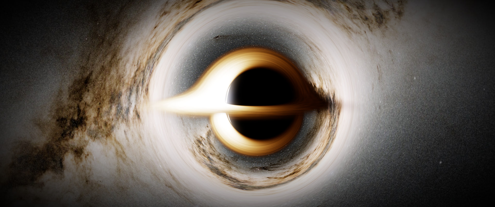
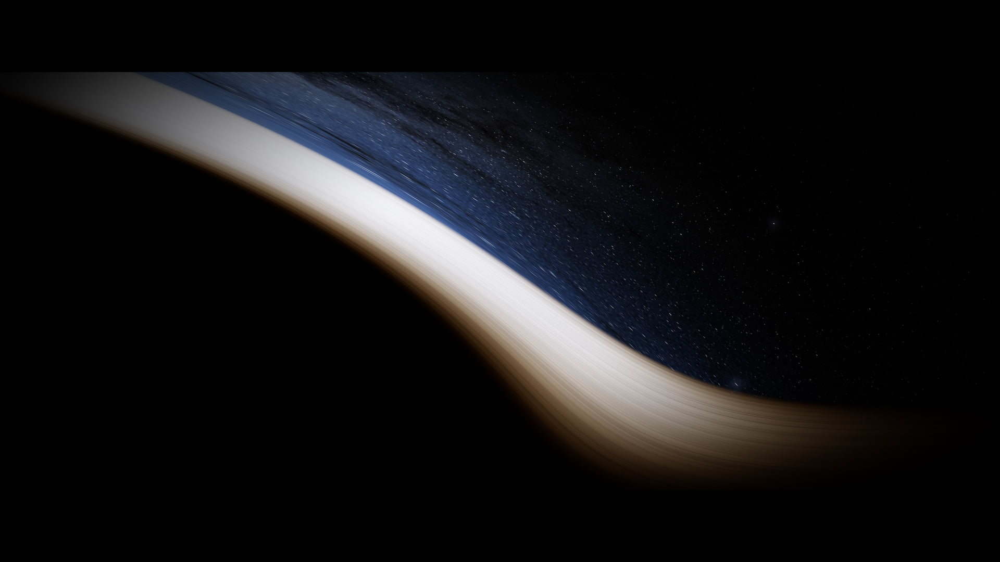
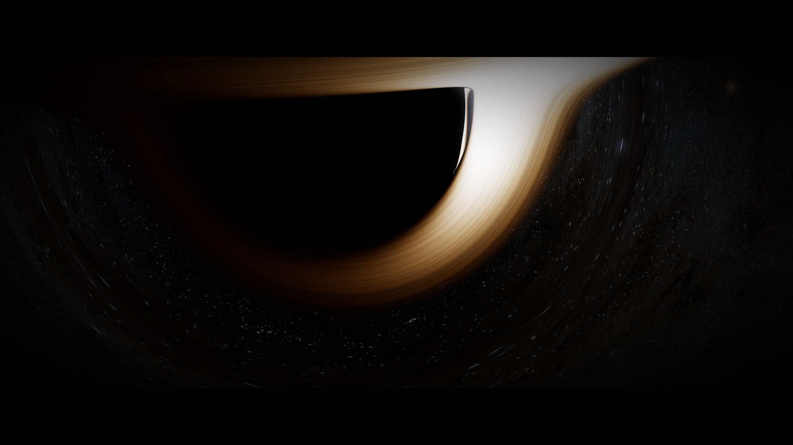
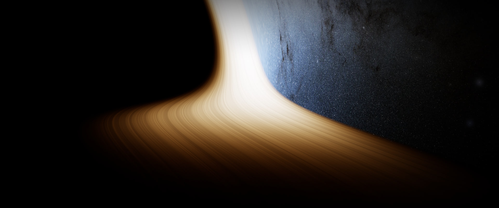
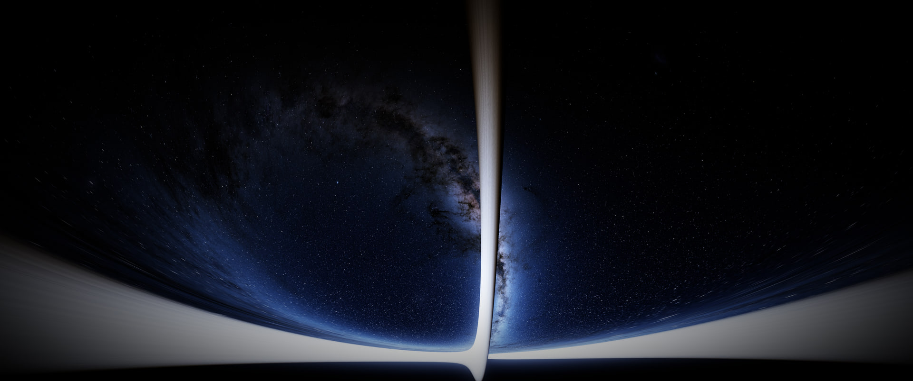
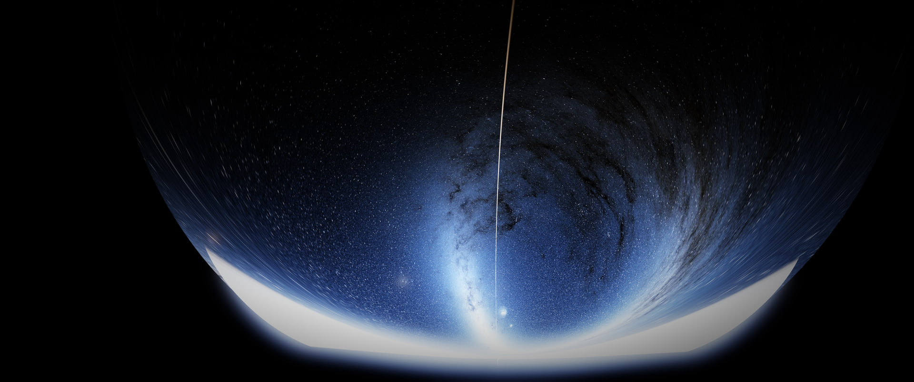

# Spacetime Sandbox



*Every pixel is a light ray traced through the exact Kerr spacetime of a spinning black hole.
Here the Milky Way is bent into a ring around the shadow, and the far side of the disk is
lifted into view above and below it.*

**Fly it in your browser: [captainchapster.github.io/spacetime/flight.html](https://captainchapster.github.io/spacetime/flight.html)**
(a desktop browser with WebGL2: recent Chrome, Edge, Firefox or Safari; keyboard and mouse).
The 4D sandbox is at [captainchapster.github.io/spacetime](https://captainchapster.github.io/spacetime/).
Every push to `main` rebuilds and republishes the site (`.github/workflows/pages.yml`).

An interactive sandbox for exploring 4D spacetime, and how its geometry *is* gravity.
Pick any three of (ct, x, y, z) to display, drop in bodies and light, and watch them follow
geodesics through a curved metric.

```
cd app
npm install
npm run fetch-sky  # once: downloads and builds the real sky (~60 MB download)
npm run dev        # sandbox: http://localhost:5173 · flight: http://localhost:5173/flight.html
npm test           # physics + projection tests (vitest)
```

## Black hole flight (`flight.html`)

Fly a ship around a real-scale rotating black hole. Every pixel is a light ray traced
backward from your eye through the exact Kerr spacetime on the GPU, so the shadow, photon
ring, lensed far side of the disk, Einstein rings, Doppler beaming and redshift all come out
of the ray tracing. None of it is painted on.

| | |
|:--:|:--:|
|  |  |
| *Skimming the disk. Its side orbiting toward you is beamed white-hot, and the sky beside it is blueshifted.* | *Close to a fast-spinning hole the shadow flattens on one side, and a thin sliver of light orbiting the hole lines its edge.* |



*Low over the disk, starlight is blueshifted and crowded together by your own motion and by gravity.*

*Captured in the game's photo mode (press K).*

**Controls:** drag to look · W/S thrust forward/back · A/D left/right · R/F up/down ·
Q/E roll · Shift for ×10 thrust · H hover autopilot · B drop a beacon · `,` `.` time warp ·
P pause.

**Ways in** (Ship → Start). The first two begin at the same spot, 6M outside the ISCO and
just above the disk, with the nose locked on the hole. They differ only in how you move:
- *Spiral in: decaying orbit.* You start on a prograde circular orbit with the retro-brake
  on, so the orbit winds down over about ten turns. At the ISCO the brake cuts out, because
  below it nothing can orbit: gravity alone whirls you round a final turn or two and in,
  exactly as the disk's gas falls.
  - Moving with the gas, the disk looks far less lopsided than it does from rest.
  - Your own speed, reaching over half the speed of light, crowds the sky ahead and blueshifts it.
- *Drop in: from rest, same spot.* You fall with no angular momentum.
  - Even so, the hole's spin drags you round as you near it: frame dragging, with no orbit
    involved.
  - You see the disk's gas sweep past at over half the speed of light, beamed bright on one
    side and dimmed on the other.

- *Spiral in: decaying polar orbit.* The same winding-down, but over the poles, starting 6M
  outside the innermost stable *polar* orbit.
  - That orbit is further out than the prograde ISCO: 5.36M for spin 0.95, against 1.94M.
    A polar orbit gets no help from the spin, so it can't hold on as close in. It's found
    from the zero-angular-momentum spherical orbits of Kerr: 6M without spin, 5.27M at the
    extreme.
  - The brake is gentler, about 2.5 g near Gargantua. Each orbit cuts through the disk's
    plane twice, and the ship passes through the gas untouched (a real disk would not be
    so kind).
  - The orbit's plane is slowly turned by the spin (Lense–Thirring precession), and the
    final plunge comes in over the poles.



*Spiralling in: at over half the speed of light, with the hole bending light around you,
the whole outside universe gathers behind you as you plunge into the dark.*



*Below the horizon. The outside universe shrinks to a bowl above and behind you,
blueshifted, its Milky Way twisted by the spinning hole. The two smudges near the bottom
are the Magellanic Clouds.*

Real orbits decay only by gravitational waves, far too slowly to watch, so the retro-brake
stands in for that loss. It thrusts against your motion relative to the local co-rotating
observer (ZAMO). Its strength (Ship → Brake: orbits to ISCO) is set from a slow-decay model
of how fast braking removes angular momentum (for a polar orbit, the non-spinning hole's
version at the same height above its innermost stable orbit). That model tracks angular momentum rather
than energy, because inside the ergosphere, where a fast-spinning hole's ISCO lies, braking
can even raise the orbit's energy. `test/decay.test.ts` checks the model against full
integrations at four spins, equatorial and polar. Near a giant hole the brake is a fictional engine: tens of g
for about a day and a half.

**Photo mode** (K, or Camera → Photo mode). Time stops and the instruments disappear. A
guide shows exactly what will be captured, with rule-of-thirds lines. Choose:
- the frame: screen, 16:9, 1.85:1, 2.39:1 anamorphic, 2.76:1, 3:2, square, 4:5 or 9:16.
  *Cinematic letterbox* puts a widescreen picture in a 16:9 frame with black bands above
  and below, like a film;
- field of view and camera roll (a Dutch angle; only the camera turns, not the ship);
- exposure, bloom, vignette, grain and a colour look (Natural is the physically computed
  colour; the others are labelled artistic and apply only in photo mode).

Space captures. The view is ray-traced again at HD, 4K or 8K, optionally 2× supersampled
(four rays per pixel), at top quality. It's rendered in tiles with a progress readout and
downloaded as a PNG. Bloom is sized relative to the image, so a large photo glows like the
preview.

G records a clip as a looping GIF: 1–8 s at 10–25 frames per second, up to 960 px wide,
at your chosen time warp, with an optional slow camera pan. Time runs forward frame by
frame, and each frame is traced offline, so the clip is smooth however slow the tracing.
Exposure is held fixed so it doesn't flicker. The game carries on from where the clip
ended. The GIF uses one palette for the whole clip and an ordered dither, so colours don't
flicker and the glow doesn't band.

**Instruments** (bottom of the screen). Speed is always relative to someone; choose who
under Ship → "Speed relative to":
- *Stationary (far-away frame), the default.* At rest relative to the far-away universe:
  "how fast am I going" in the everyday sense. Such an observer can't exist inside the
  ergosphere, where space is dragged around too fast, so your speed against it climbs
  toward c at the ergosphere's edge. Inside the ergosphere the reference no longer exists,
  and the instruments fail the way a real ship's would (see *Nav faults* below).
- *Falling space (river).* In Hamilton & Lisle's river model, space flows
  inward like a river at the escape speed: light speed at the horizon, faster inside. For a
  spinning hole these are Doran's observers. They exist everywhere, so readings never jump,
  through either horizon. Falling in from far away reads ~0 (you drift with the current);
  hovering reads the escape speed √(2M/r) upward (swimming against it).
- *Hold-still (ZAMO).* A zero-angular-momentum observer, held at your height while
  co-rotating with the dragged space. Natural for orbits, but it ends at the horizon, where
  no one can hold still. Approaching the horizon, anything falling passes it at nearly c.

`test/nav.test.ts` checks all three:
- stationary: zero for a hovering ship, and invalid inside the ergosphere;
- the river: zero for a free faller, √(2M/r) for a hover, smooth across the horizon;
- the ZAMO: against the exact Bardeen–Press–Teukolsky orbital speeds.
The instruments are modelled as hardware you could build today, flown into a black hole:
- *Navball:* a rigid ball on a gyro platform. The sky half points away from the hole and
  the ground half toward it; north is the spin axis and east is the way it spins. The
  gyroscopes are Fermi–Walker transported, like the ship's own frame. While the reference
  observer exists, the navigation computer aligns the platform to their East–North–Up axes,
  carried into the ship's frame by the exact Lorentz boost between you. That is a pure
  rotation, so the ball never stretches, whatever your speed. (Where light *appears* to come
  from, with aberration, is the 3D view's business, not the ball's.) Markers show prograde,
  retrograde, normal, radial and the hole.
- *Annunciators* along the top: the reference mode (REF STAT / ZAMO / RIVR) and caution
  lamps: NAV (no navigation solution), SIG (no signal from home), and TIDE (tidal stretch
  across the hull above 1 g, flashing red above 100 g).
- *Speed tape:* on a rapidity scale, so 0.9c, 0.99c and 0.999c are all readable, with
  vertical speed.
- *Altimeter:* height above the horizon, marked with the photon orbit, ISCO, ergosphere and
  disk edge. It's computed from the navigation state, so it doesn't stop at the horizon: it
  pegs and reads negative.

*Nav faults.* A real navigation computer doesn't quietly switch reference when its own
stops existing: it fails. So does this one. When the chosen observer can't exist (stationary
in the ergosphere, hold-still inside the horizon), the computer stops aligning the platform
and an orange striped OFF flag drops across the ball, like the warning flag on an Apollo
attitude indicator. The ball keeps working on gyros alone: turn the ship and it turns, and
any real gyroscopic precession shows. The navigation markers vanish, the NAV lamp lights and
the speed tape reads NO REF. The autopilot lets go: Hold and every lock that steers by the
navigation solution (prograde, normal, radial and so on) drop to Free, and the ship flies
on its gyroscopes. None of them re-engage until the reference is back. Target lock still
works, because it only needs the beacon's position. Pick
"Falling space (river)" and the instruments work all the way down.

*Home signal* (HUD). This is what the ship can actually measure: the frequency shift of a
radio signal from far away, arriving from straight up. It's traced with real light rays. The
HUD also shows the speed a naive Doppler speedometer would infer from that shift,
v = (1 − g²)/(1 + g²). Such a speedometer can't tell gravity from motion: hover low and it
insists you're racing toward home. The "Far-away clock" row is coordinate time, the
simulation's convention for "what time is it there now"; the home signal is what you'd
actually see.

**Ray-tracing robustness near the hole:**
- Light can momentarily stand still in these coordinates at the ergosphere's surface, so the
  step size is bounded by the ray's motion through time as well as space. This was once
  the source of spurious blue specks inside the shadow.
- Rays already inside the innermost photon orbit and heading in are stopped as captured,
  as are rays hugging the horizon from outside and heading in. Only those heading in: a
  camera a hair above the horizon must still trace its outward rays. (Once, every ray
  within 1% of the horizon was stopped, which blacked out the screen for the last few
  frames before crossing.)
- Any ray that stops being null (H ≠ 0) is discarded rather than drawn.
- The ship's frame can never become its own mirror image. When it turns, its "right" axis
  is rebuilt from a hint, and at high speed in strongly curved coordinates that hint once
  picked the mirror image. Just outside the ergosphere, the hole and the disk would suddenly
  swap sides of the screen. The frame's handedness (the sign of det[u; e₁; e₂; e₃]) is
  now fixed at the start and restored after every turn. `test/handedness.test.ts` replays
  that spiral.

`test/ergosphere.test.ts` reproduces the original bug and checks that every pixel's fate is
the same at the game's step size and a much finer one.

**Attitude modes (SAS).** Use the buttons above the navball or the number keys:

| Key | Mode |
|---|---|
| 1 | Hold |
| 2 / 3 | Prograde / retrograde |
| 4 / 5 | Radial in (the hole) / out |
| 6 / 7 | Orbit normal / anti-normal |
| 8 | Target (T cycles beacons) |
| 0 | Free gyroscope |

Reaction wheels slew the nose onto the chosen direction, at a steady rate plus however far
the target itself moved since the last frame. So a lock catches up smoothly and then keeps
up at any time warp: however fast the target swings round on screen, in the ship's own time
it turns slowly (radial in turns once an orbit), which real wheels track easily. Turning by
hand drops you back to Hold.

*Hold* is an attitude-hold autopilot. It holds the heading, pitch and roll shown on the
navball, so it needs the navigation solution like the locks do. (It once held raw coordinate
directions instead. Deep in the hole, at near light speed, those get badly distorted, and
the ship was thrown about.) *Free* fires nothing: the ship's axes are carried by its
gyroscopes, which is always well defined, even inside the horizon.

The locks aim where the navball shows each direction, so a lock puts its marker dead
centre on the ball. At speed that differs from where the same direction appears in the 3D
view, which shows aberration. Two caveats:
- The target direction is the straight line to the target's current position, which
  ignores light delay and lensing.
- Auto-exposure reads the GPU asynchronously, so it never stalls a frame.
- Rays are stopped as soon as their fate is certain, exactly rather than by rule of thumb.
  Each ray has three conserved quantities: its energy, its angular momentum about the spin
  axis and Carter's constant. From these, the radial equation says whether a ray heading in
  will ever turn back before the horizon. If it won't, it's captured at once, as long as
  nothing else lies on its way in: the ray must already be inside the disk's inner edge and
  beyond every beacon's reach. (Without that condition, rays that pass through the disk
  on their way in were stopped too soon, leaving black blocks over the disk in front of the
  shadow.)
  - From inside the horizon, the sign of the ray's energy relative to the horizon's
    rotation, E(r₊² + a²) − aL, says which half of the horizon it leaves through. The half
    belonging to the idealised solution's other universe is black from the first step.
  - A ray stalled at the horizon (radius frozen, coordinate time racing away) is stopped
    too.
  - Before, rays crawled toward horizons they never cross until they ran out of steps.
    Close in, a third of all pixels did this; inside the horizon facing the hole, every
    pixel did. Now the average steps per pixel are 4.4× fewer close in (327 → 74) and 2.2×
    fewer inside (900 → 407), for the same picture.
  - `test/capture.test.ts` checks that every ray stopped early meets the same fate (hole,
    disk or sky) as a fine integration without the shortcut, from five vantage points,
    inside the horizon included, with the disk in place.
  - For profiling, `flight.countSteps()` in the browser console reads back each pixel's
    step count.
- Adaptive resolution (Camera menu, on by default) traces at a lower resolution when frames
  take longer than 1/40 s, never above Render scale. The physics is the same, only coarser.
  - Every change of resolution re-samples every star, which shows as a jitter where lensing
    crowds them together. So it changes only on sustained evidence: down after 3 slow
    seconds in a row, up after 5 fast ones, and never back up within 20 s of stepping down.
- The navball is repainted only when it actually turns, and without per-pixel trigonometry.
  It had been the largest CPU cost, more than all the physics.
- A new picture is traced only when there's something new to see. While paused, the view is
  re-traced only when you look around, change a setting or resize the window. Once the
  journey has ended, the last frame stays behind the epilogue. Before this, the GPU kept
  re-tracing the costliest light paths in the whole simulation (from just above the inner
  horizon), unseen.

**Falling in.** Crossing the horizon is locally unremarkable (the equivalence principle):
nothing flashes or jumps. What changes is where the outside universe is.
- As you fall, aberration crowds the outside sky toward where you came from.
- Inside the horizon it sits *behind* you, so press **V** to look back, or SAS **5** to
  turn round.
- For a non-spinning hole, falling from rest far away, it fills a disk around the zenith
  that shrinks from 138° in radius at the horizon toward a hemisphere at the singularity.
  Its centre reddens (light from straight up arrives at 1/(1 + √(2M/r)) of its energy)
  while its rim is increasingly blueshifted. You never lose sight of it before the end.
- `test/inside.test.ts` checks the sky's edge and the zenith redshift against that exact
  result at three depths. GPU renders match it to within half a degree, down to r = 0.2M.
- Auto-exposure compensates for the darkening, like an adapting eye. Turn it off to see the
  true dimming.

**How the journey ends.** There are three endings, each where the physics says, not at an
arbitrary radius:
- *Spinning hole: the inner horizon, r₋.*
  - The exact Kerr solution carries on past r₋: below it r is a space direction again, the
    singularity is a ring you can fly past, and the solution continues through the ring into
    a negative-mass universe and out through a white hole into another universe.
  - A real hole is expected to end at r₋ instead, but which half of r₋ matters. The
    famous "the whole future of the universe flashes before your eyes" happens at the
    *Cauchy horizon*. That half is where all of the outside's future arrives, infinitely
    blueshifted, and in a real hole it becomes a singularity (mass inflation: Poisson &
    Israel 1990; Ori 1991).
  - A ship falling in crosses the *other*, "outgoing" half, before most of the outside's
    future has happened. In the exact solution that crossing is calm. For anyone falling in
    long after the hole formed, it becomes an effective shock wave that crushes them almost
    instantly (Marolf & Ori 2012).
  - Up to r₋ the view is computed exactly. On the way in, light from outside reaches about
    50× its original energy (for spin 0.95), not infinity. The final white-out is labelled
    as illustrative, not computed.
- *Non-spinning hole: the central singularity.* Inside the horizon, r = 0 is a moment
  rather than a place, and every path reaches it.
- *Torn apart by tides.* The hull of the 100 m ship fails when the tidal stretch from nose
  to tail passes 1000 g.
  - Near a 10-solar-mass hole that happens well outside the horizon, at about 200M. No start
    puts you somewhere that lethal, or every restart would be instant death. Where a start
    would put the ship in tides over 10 g, it moves straight out to where they're exactly
    10 g (944M for the stellar hole), with a caption saying why.
  - Near Gargantua it happens only within about 0.004 M of a non-spinning centre.

`test/ending.test.ts` checks each ending: falls at several angles and spins stop within one
step of r₋, a non-spinning fall reaches the singularity, and the tidal limits fall where
they should. Ship steps now shrink rather than leap when the curvature changes fast. A
frame deep in the hole may cover less proper time, but a step is never wrong.

**Ambience** (Ambience menu). Space is silent, so the sound is a *sonification*: the ship
turning what it sees and feels into sound. Every voice follows the physics:
- a hum pitched by the frequency shift of the light ahead;
- a heartbeat on your proper time and a chime on home's clock, at the rate its ticks
  actually reach you (the home signal's shift). It races as you hover low, slows as you fall,
  and goes quiet if the signal is lost;
- engines that rumble with the acceleration you feel (silence in free fall);
- hull creaks with the real tidal stretching 2GML/r³. Gentle at Gargantua, lethal near a
  10-solar-mass hole;
- beacon pings, one per blink, when that blink's light actually reaches you. That's found
  with real light rays, and the ping is pitched by the light's shift.

Captions mark real landmarks as you cross them (photon region, ISCO, ergosphere, horizons)
along with speed and time-dilation milestones. An epilogue compares your clock with the
far-away one when the journey ends. Cinematic mode (**C**) hides the UI and letterboxes the
view, with film grain and a vignette. `test/observe.test.ts` and `test/story.test.ts` cover
the physics and the captions.

**Experiments to try:**
- *Drop a beacon into the hole.* Pick the "Experiment" start, or press B anywhere. A beacon
  is a glowing sphere that blinks on its own clock. As it falls:
  - its blinks slow and its light reddens;
  - it freezes at the horizon and fades away, though its own clock says it crossed in
    finite time.

  The rays meet its recorded worldline at the right moments, so this isn't scripted.
- *The velocity budget.* The HUD bar shows how your motion splits between time and space,
  relative to someone hovering where you are: (dτ/dt)² + v² = 1, always.
- *Lensing grid.* Camera → Sky → "Lensing grid" replaces the stars with lines of latitude and
  longitude, so you can see how the sky folds around the photon ring.
- *Frame dragging.* Hover by a spinning hole, switch the attitude to Free gyroscope (key 0),
  and turn up the time warp. Your ship is now a free gyroscope, and it slowly turns as the hole's
  rotation drags space around:
  - prograde at 2J/r³ over the poles;
  - retrograde at J/r³ at the equator.

  This is the Lense–Thirring effect that Gravity Probe B measured around Earth.
  `test/autopilot.test.ts` checks both rates. In Hold (the default), the reaction wheels
  keep you pointed relative to the local frame instead.

The hover autopilot recomputes its thrust on every physics substep and holds an anchor point.
That keeps it stable at any time warp; it once diverged when frames spanned hundreds of M.

**Exact physics:**
- *Spacetime:* the Kerr metric in Cartesian Kerr–Schild coordinates, regular at the horizon.
- *Light:* null geodesics from the Hamiltonian H = ½g^μν p_μ p_ν, with analytic derivatives
  and RK4, in 32-bit floats on the GPU.
- *The ship:* a worldline and an orthonormal frame. Thrust is proper acceleration in the
  ship's frame, and the frame is Fermi–Walker transported, so gyroscope precession is real.
  The camera is that frame, so aberration and Doppler shift from your own motion are exact.
- *The disk:* a Novikov–Thorne thin disk, with temperatures from the hole's mass, spin and
  accretion rate (as a fraction of the Eddington rate). Its colour is the CIE-integrated
  blackbody spectrum at g·T. Since I_ν/ν³ is invariant along a ray, that's exact for
  thermal light.
- *Real scale:* masses in solar masses, distances in km/AU and times in seconds/days, with
  time warp and fictional engines as player controls. Hovering 28M from a 10⁸ M☉ hole really
  takes 82 g.

**The real sky** (Camera → Sky; the procedural starfield and the lensing grid remain as
options). It is the sky as seen from Earth, as if the hole were near the Sun:
- *Milky Way glow:* NASA/GSFC SVS *Deep Star Maps 2020*, in its version without the bright
  stars (Gaia DR2: ESA/Gaia/DPAC), in galactic coordinates.
- *Stars:* the 117,955 Hipparcos-2 stars are drawn as exact points with their real
  positions, brightnesses and colour temperatures. That keeps their Doppler shifts and
  lensed images exact; a star's total brightness on screen scales with the lensing
  magnification.
- *Checks:* `npm run fetch-sky` calibrates star brightness against NASA's own rendering of
  the same stars. It also checks that every catalogue star lands on its image in NASA's
  map: mean 0.28 px over 308 stars. In the app, Orion's stars appear where predicted (not
  mirrored), and the glow is brightest toward the Galactic Centre.
- *Approximation:* the diffuse glow's colour shift treats it as ~4500 K starlight, since the
  map has no spectra.

You can rotate the sky about the hole with Sky yaw and tilt. By default you look past the
hole toward the Galactic Centre.

**Artistic choices, labelled as such in the UI:**
- the procedural starfield and galaxy (and their brightness relative to the disk);
- the disk's turbulence texture. The motion is not artistic: each part of the pattern
  orbits at the exact Kerr orbital speed for its radius, and you see it as it was when its
  light left. Eddies don't last: each lives about two orbits of the disk's inner edge, then
  fades as a new one takes its place, as turbulence keeps renewing a real disk.
  - Without that, the differential rotation would wind any pattern into ever finer
    spirals. After a long time warp the disk then looked frozen and grainy, though its gas
    was moving as fast as ever.
  - The eddies' life cycle runs on one clock for the whole disk. A fixed, smooth offset with
    radius keeps it from all renewing at once. A clock ticking at each radius's own orbital
    rate would wind up in the same way.
- bloom, ACES tone-mapping and auto-exposure (camera effects);
- the optional "Interstellar look", which switches off the disk's frequency shifts. The
  film did the same; real disks are lopsided, as in the EHT images.

**Limits:**
- The ship is a test body; it doesn't perturb the hole.
- There are no planets yet.
- The disk is geometrically thin, with no corona or jets.
- The view from *inside* the horizon is traced but experimental. Between a spinning hole's
  two horizons, some backward-traced rays can't be followed in these coordinates and render
  black.

**Verified:**
- `test/kerr.test.ts` checks the ray tracer (which the shader mirrors line for line):
  - the analytic derivatives match the metric;
  - the shadow edges match the exact critical impact parameters of Kerr photon orbits
    (2.844M prograde, −6.832M retrograde at a/M = 0.9) and 3√3 M without spin.
- `test/ship.test.ts` checks the ship and the disk:
  - hyperbolic motion under constant thrust;
  - the exact hover thrust M/(r²√(1−2M/r));
  - geodetic precession of 2π(1−√(1−3M/r)) per orbit;
  - the ISCO and the 32% efficiency limit;
  - the disk flux against the Page–Thorne closed form.
- `test/beacons.test.ts` checks the beacons:
  - a hovering beacon is redshifted by exactly √(1−2M/r);
  - one falling from rest at infinity is shifted by exactly 1 − √(2M/r);
  - moving beacons appear where they were when their light left, not where they are now;
  - the worldlines handed to the GPU are the exact geodesics, with unit 4-velocities.
- `validation/test_kerr_disk.py` shows the Kerr metric is a vacuum solution, and that the
  disk-flux integral equals the closed form to 10⁻¹⁰.
- GPU renders were measured in pixels:
  - Schwarzschild shadow radius: 9.67° rendered vs 9.63° predicted at 30M, and 23.27° vs
    23.28° at 12M;
  - Kerr (a = 0.9): edges of 5.44°/12.53°/8.94° vs 5.37°/12.58°/9.00° from the verified CPU
    tracer. That's within a pixel.

## How it works (sandbox)

**Simulate in 4D, render projections.** Every body is a free-falling test particle whose
geodesic is integrated in coordinate time. Its past is stored as a *worldline*: a list of
events (t, x, y, z, τ). Views only ever read worldlines, so "which three axes to show" is
purely a rendering choice:

- **(ct, x, y)** and friends: time is vertical, "now" sits at height 0 and the past extends
  below. Bodies are *projected* (the hidden axis is dropped). Fields (light cones, clocks,
  grid) are *sampled* on the "now" slice at the hidden coordinate set by the slider.
- **(x, y, z)**: the ordinary view. The slice is t = now, worldlines become trails, and
  fields are sampled on the plane z = slider.

- **Time-warp surface (t, r)**: the radial (t, r) plane drawn as a curved surface on which
  every radial free fall is a straight line (after R. Jonsson, *Am. J. Phys.* 73, 248, 2005).
  Time runs around the surface and r runs down it. The surface flares out where clocks run
  slow, and a body "at rest", moving purely through time, follows a straight line that drifts
  toward the flare. That drift is the fall: gravity as the shape of time. In flat
  spacetime the surface is a plain cylinder. See `app/src/physics/embedding.ts` for the
  derivation.

**Everything derives from the metric.** A `Spacetime` (`app/src/physics/spacetime.ts`) only
has to provide `g_μν(x)`. Christoffel symbols come from finite differences
(`numericalChristoffel`), and geodesics from RK4 with re-normalisation of the 4-velocity.
Light cones come from solving `g(u, u) = 0` (`lightcone.ts`). Static clock rates are
`√(−g_tt)`.

**The black hole uses Kerr–Schild coordinates**: Cartesian-like, and regular at the horizon,
so bodies fall through it smoothly instead of freezing at r = 2M as they would in textbook
Schwarzschild coordinates.

### Layout

```
app/src/physics/     metric-agnostic core: no rendering, no DOM
  linalg.ts          4-vectors, inverses, Cholesky, quadratics
  spacetime.ts       Spacetime interface, numerical Christoffels, clock rates
  metrics/           Minkowski, Schwarzschild (Kerr–Schild)
  geodesic.ts        RK4 geodesic step, normalisation, initial conditions
  body.ts            a test body + its recorded worldline
  world.ts           the simulation: spacetime + bodies + coordinate time
  lightcone.ts       null-cone cross-sections at an event
  orbits.ts          closed-form orbit initial conditions and periapsis advance
  embedding.ts       the time-warp surface for static, spherical spacetimes
  metrics/kerr.ts    rotating black hole (Kerr–Schild)
  kerrRays.ts        light-ray tracer in Kerr (incl. moving glowing bodies); the GPU shader mirrors it
  ship.ts            thrusting ship with a Fermi–Walker-transported frame
  nav.ts             local East–North–Up frame for the cockpit instruments
  sky.ts             galactic coordinates, star colours, star lookup grid
  disk.ts            Novikov–Thorne accretion disk
  blackbody.ts       blackbody → CIE XYZ → sRGB
  units.ts           SI constants and real-scale conversions
app/src/flight/      the flight game: WebGL2 ray tracer, bloom, HUD, controls, beacons, real sky
app/scripts/         build-sky.mjs: downloads and calibrates the real-sky data
app/src/view/        Three.js rendering
  projection.ts      4D event → 3D display (axis choice, slice, boost, now-offset)
  spacetimeView.ts   the drawing layers
app/src/scenarios.ts preset scenes
app/test/            vitest checks against exact GR results
validation/          independent Python checks (SymPy / SciPy)
```

### What's verified

- `app/test`: straight lines and time dilation in flat spacetime; a circular orbit at 10M
  closes with the exact period and orbiting-clock rate √(1 − 3M/r); an 8M–20M orbit
  precesses by the exact GR amount (to 10⁻³ rad); light holds on the r = 3M photon sphere;
  infall reaches the singularity in the exact proper time; light cones tip inward inside the
  horizon; boosts keep light at 45°. The time-warp surface is an isometric drawing of its
  metric, and a body thrown upward in the full simulation tracks a straight line on it to
  within 0.002M. As a control, the same start on the flat cylinder doesn't come back down.
- `validation/` uses separate code and separate coordinates. It proves symbolically that the
  Kerr–Schild metric solves the vacuum Einstein equations, and checks the orbit formulas,
  the infall time and the 3√3 M photon-capture threshold. It also shows symbolically that the
  surface's straight lines and radial free falls obey the same equation for any energy, with
  light as the high-energy limit.

```
cd validation
python -m venv .venv && .venv/Scripts/pip install -r requirements.txt   # (bin/ on macOS/Linux)
.venv/Scripts/python -m pytest -q
```

## Limits (on purpose, for now)

- Bodies are **test particles**: they feel the geometry but don't source it. There's no exact
  GR solution for several mutually-gravitating bodies. That needs a weak-field N-body
  approximation (below) or full numerical relativity.
- The (x, y, z) view shows a coordinate-time slice, not what an observer would *see*. Seeing
  needs light-travel delay and lensing, i.e. ray tracing along null geodesics.
- The boost is a display transform in spacetime views only.

## Roadmap

1. ~~Flat spacetime: projections, light cones, proper-time ticks, boosts~~
2. ~~Schwarzschild: orbits, infall, light bending, static clocks, falling dust grids~~
2½. ~~Time-warp surface: radial free fall as straight lines on curved time~~
3. Coordinate-chart switcher (Schwarzschild / Painlevé–Gullstrand / Kruskal views of the
   same events): the grid depends on coordinates, the physics doesn't
4. Weak-field N-body: masses that move and attract each other (1PN / EIH equations), with
   the superposed metric driving the cones and clocks
5. Kerr (rotating) black holes, and linearised gravitational waves
6. An observer camera: ray-traced view of what a body actually sees
